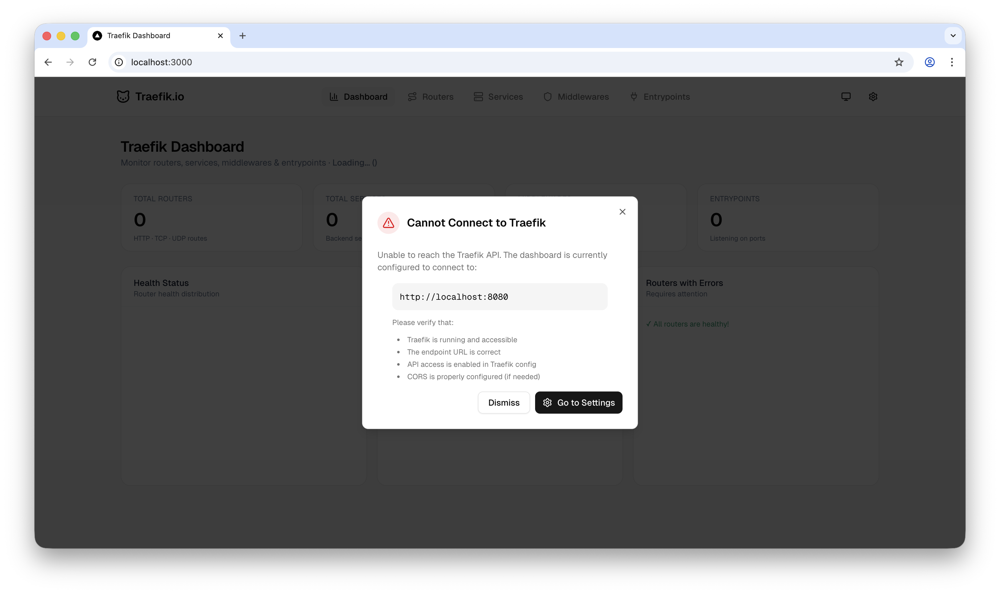
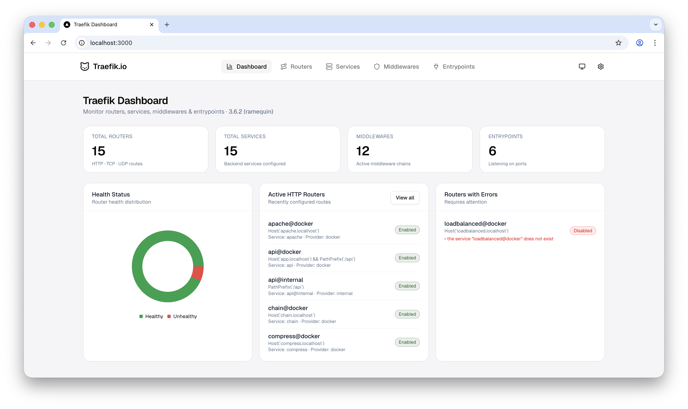
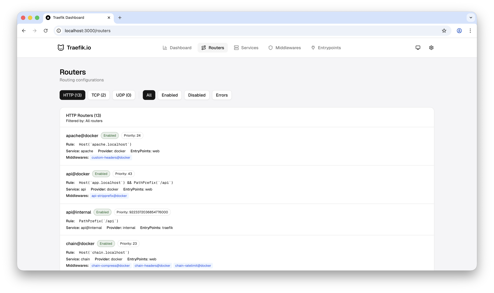
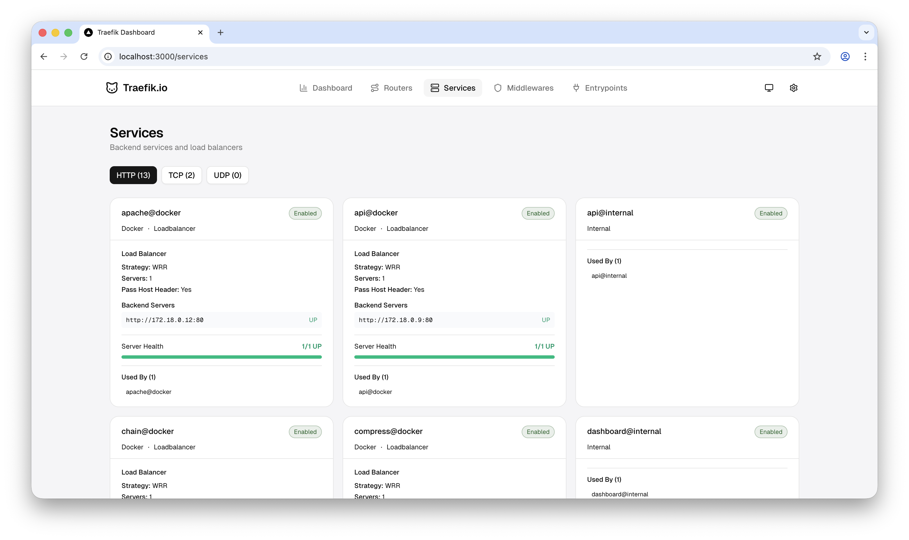
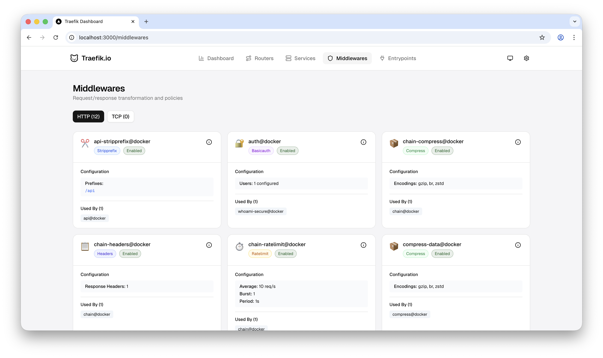
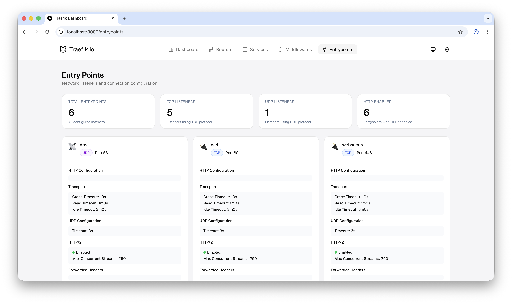
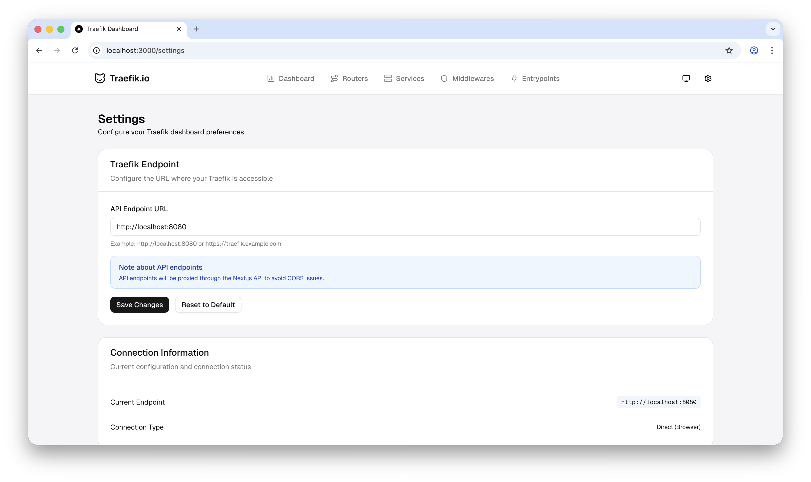
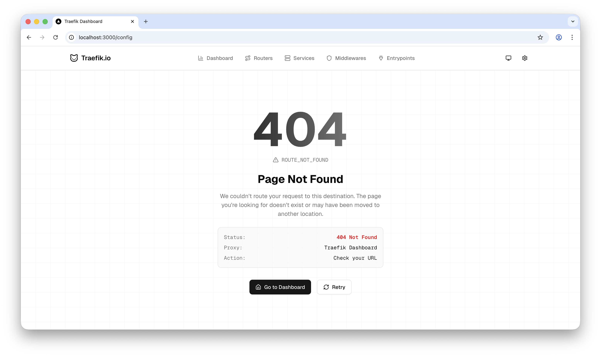

# 🚀 Traefik Dashboard

A clean, modern, read-only dashboard for monitoring your **Traefik** setup.
This tool focuses exclusively on **visualizing Traefik data**, tracking its status, and giving you insights into routers, services, middlewares, and entrypoints — **without modifying your live Traefik configuration**.

Built with **Next.js 16**, **React 19**, **Tailwind v4**, and **shadcn/ui**, the dashboard is optimized for both desktop and mobile use with a smooth, responsive UI.

> **Note**: This dashboard is purely for viewing Traefik status. All configuration changes must still be done manually in your Traefik files.
> If you want configuration editing support in the future, let me know. If it’s feasible, I’ll explore implementing it.

---

## ✨ Features

### 📡 Real-Time Traefik Visibility

- **Live Dashboard** showing an overview of the running Traefik instance
- **Routers, Services, Middlewares, Entrypoints** — all available in dedicated pages
- **Filtering & search** for quick navigation
- **Responsive UI** that works beautifully on both mobile and desktop

### 🕵️ Version Checker (Auto-Update Awareness)

- The system checks GitHub to see if a new Traefik release is available.
- If your running Traefik version is older, a **popup alert** helps you understand what’s new and what steps you may need to take.

### 🎨 Elegant User Experience

- **Dark Mode / Light Mode** toggle
- Clean UI built with **shadcn/ui**
- Thoughtful animations and layouts for a premium feel

### ⚙️ Customizable Traefik Endpoint

- Set your own Traefik API endpoint in the **Settings** page
- Supports local or remote Traefik instances
- Saves your chosen endpoint for easy reconnecting

### 🚨 Error Handling & Alerts

- Smart detection for unreachable Traefik servers
- Toast notifications for network issues or API errors
- Automatic recovery when the connection is restored

### 🔧 Current Tech Stack

- **Next.js 16** (App Router + React Server Components)
- **React 19**
- **Tailwind CSS v4**
- **shadcn/ui**
- **Zustand** for global state
- **Axios** for API communication
- **Lucide Icons** for UI icons
- **Recharts** for visualizations
- **Sonner** for toast notifications

---

## 📸 Screenshots

|                                                                          |                                                                   |                                                                |
| :----------------------------------------------------------------------: | :---------------------------------------------------------------: | :------------------------------------------------------------: |
|  |      |  |
|         |  |  |
|     |     |                                                                |

---

## 📊 What You Can View

### Dashboard Overview

A high-level glance at:

- Total routers
- Total services
- Middlewares count
- Entrypoints count
- Version status
- Basic health indicators for routers

### Routers

- View all HTTP, TCP, and UDP routers
- Inspect their rules, services, middlewares, and status

### Services

- See all registered services
- Understand load balancer structure and linked servers

### Middlewares

- Explore all middlewares
- Know which rules and config options are set

### Entrypoints

- Track active entrypoints
- View configurations

---

## 🚀 Getting Started

### 1. Clone the Repository

```bash
git clone https://github.com/atharvaunde/traefik-dash.git
cd traefik-dash
```

### 2. Install Dependencies

```bash
npm install
# or
yarn install
```

### 3. Start Development Server

```bash
npm run dev
```

Visit: **[http://localhost:3000](http://localhost:3000)**

### 4. Configure Traefik Endpoint (Optional)

On first load, the dashboard asks for your Traefik API URL.
Default: `http://localhost:8080`

---

## 📧 Contact

**Atharva Unde**
GitHub: [https://github.com/atharvaunde](https://github.com/atharvaunde)
Website: [https://atharvaunde.com](https://atharvaunde.com)
